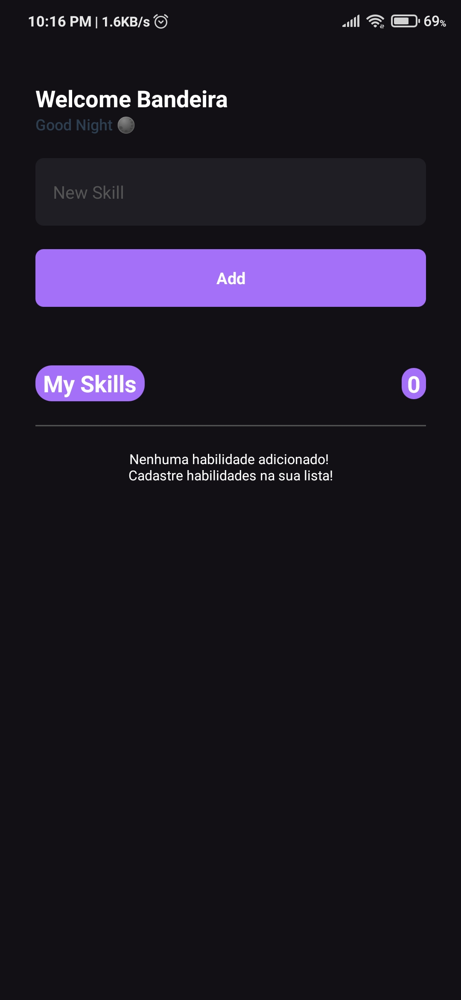

<p align="center">
  <h1 align='center'>MY SKILLS - APP </h1>
</p>

<p align="center">
    <strong>Aplicativo mobile que tem como objetivo cadastrar habilidades técnicas de um usuário.</strong>
</p>

<p align="center">
  
  
  
</p>

<p align="center">
 <a href="#-sobre-o-projeto">Sobre</a> •
 <a href="#-funcionalidades-do-projeto">Funcionalidades</a> • 
 <a href="https://github.com/bandeirapk/my-skills/edit/main/README.md#%EF%B8%8F-tecnologias-utilizadas">Tecnologias</a> • 
 <a href="https://github.com/bandeirapk/my-skills/edit/main/README.md#%EF%B8%8F-instala%C3%A7%C3%A3o-e-uso">Instalação</a>
</p>

<h4 align="center"> 
	🚧  Projeto concluído 🚀 🚧
</h4>

<br>

## 💻 Sobre o Projeto

O MySkills app foi desenvolvido durante o curso Ignite da Rocketseat, com o objetivo de praticar os conceitos de React Native e Typescript para fixar os fundamentos visto nas aulas. O projeto consiste em um aplicativo mobile que tem como objetivo cadastrar habilidades técnicas de um usuário que usa vários conceitos fundamentais para quem trabalha no ambiente de desenvolvimento mobile.

<div>
  
</div>

<br>

## 🔨 Funcionalidades do projeto

- [x] Inserir Habilidades
- [x] Contador de habilidades de forma estática
- [x] Remover Habilidades
- [x] Conceitos de imutabilidade ao alterar o estado
- [x] Não permitir adicionar habilidades vazias ou repetidas
- [x] Sair do input ao toque em outro local da tela

## ✔️ Tecnologias utilizadas

- [ ] React Native
- [ ] Typescript
- [ ] Javascript
- [ ] NPM
- [ ] NodeJs

## 📱 Funcionamento da aplicação

<div> 
  
</div>

<br>

## 🛠️ Instalação e uso

Você pode baixar o projeto e rodar em seu computador seguindo os passos abaixo:

[MySkills](https://github.com/bandeirapk/my-skills/archive/refs/heads/main.zip) - Baixar o projeto

```bash
# Clone este repositório
git clone https://github.com/bandeirapk/my-skills.git

# Acesse a pasta do projeto
cd my-skills/

# Instale as dependências
npm install

# Rode o Metro do React Native
npx react-native start

# Em seguida, abra o emulador ou conecte seu dispositivo e rode o projeto.
# Para Android:
npx react-native run-android

# Para IOS:
npx react-native run-ios
```

Feito com ❤️ por [Bandeira Magalhães](https://github.com/bandeirapk)
